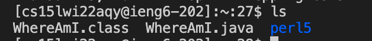

# Lab Report 1
1) Installing VScode
>
First go to the website https://code.visualstudio.com/ to download the correct version of VSCode for your computer (Macs OX or Windows). Then follow the instructions to install it on computer. The VSCode should look like this after installation:


2) Remotely Connecting
>
There is a specific account for every CSE15l students, which should looks like cs15lwi22xxx@ieng6.ucsd.edu (replace the xxx with your assigned characters). First make sure to find it. Then, open the terminal on VSCode, and type
`ssh cs15lwi22xxx@ieng6.ucsd.edu`
Then, it will ask for the password. Type the password to connect the server. (set up a new password at https://sdacs.ucsd.edu/~icc/index.php if you forget)


This would appear if successfully connect to the remote sever: 


3) Trying several commands
>
There are some commands that have specific functions in ssh server, for example:

cd: change back to the home directory (no change becasue already in here)


ls: list files in current directory



ls -a: list all files in the servers


ls -lat: list all files according to access date


pwd: print working directory


4) Moving Files with scp
>
Using scp can securely copy the files on computer to the server. For example, a java file called WhereAmI is created that contain some print methods, and it can be copied to the remote server if writing this in the terminal:
`scp WhereAmI.java cs15lwi22xxx@ieng6.ucsd.edu:~/`

The password for ssh is also needed in this part.
After performing that, an ls method should show the WhereAmI.java in the home directoty. And then can write command to compile and run it on the server.


5) Setting an SSH Key
>
This step helps to get rid of the process of entering password every time you log in or create secure copy to the server. Write the below code on the VSCode terminal below:

```
# code block
ssh-keygen
Generating public/private rsa key pair.
Enter file in which to save the key (/Users/userid/.ssh/id_rsa): /Users/userid/.ssh/id_rsa
Enter passphrase (empty for no passphrase): 
Enter same passphrase again: 
```

A key fingerprint and image will be generated. After the key is generated, next step is to set the key to the ssh directory to complete the process. Log into the remote sever again and write the code as below:

```
# code block
ssh cs15lwi22xxx@ieng6.ucsd.edu
Password: <Enter Password>
mkdir .ssh
```

After that, it is able to log into the ssh without having to enter password. It should look like this:


6) Optimizing Remote Running
>
There are some ways to make the command more concise and merge several commands in the same line to run them together. 
For example, put the command in quotation mark after the ssh command will log in the server, run the command in the quotation mark on the server, and immediately log off the server.


In this method, ls is performed on the server to list the files, and it immediately return back to the client after this.

Semicolon can be used to join several commands together in one line to make the command consice. 


This command copy the file WhereAmI.java to the server, compile it and run it using just one command. 