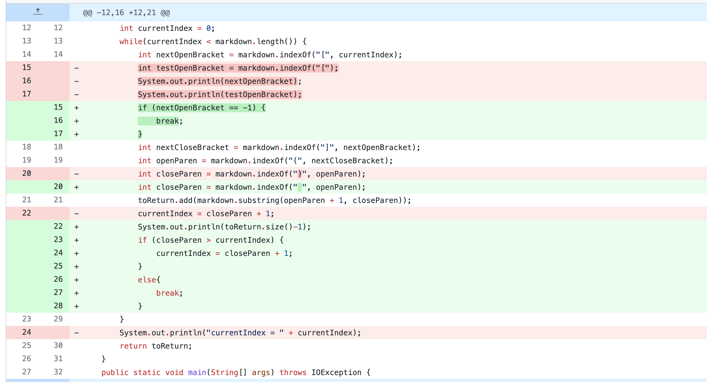
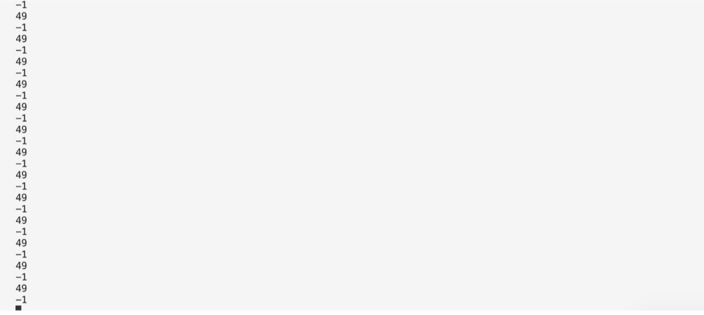
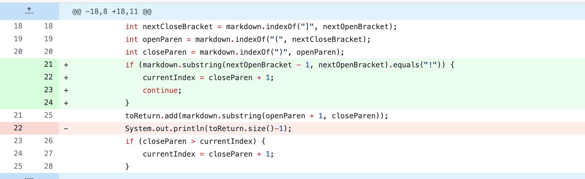
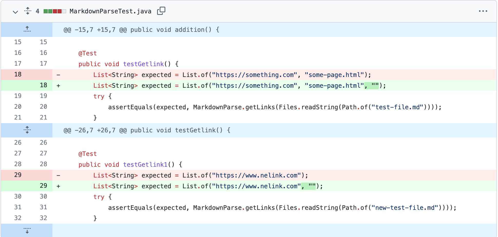
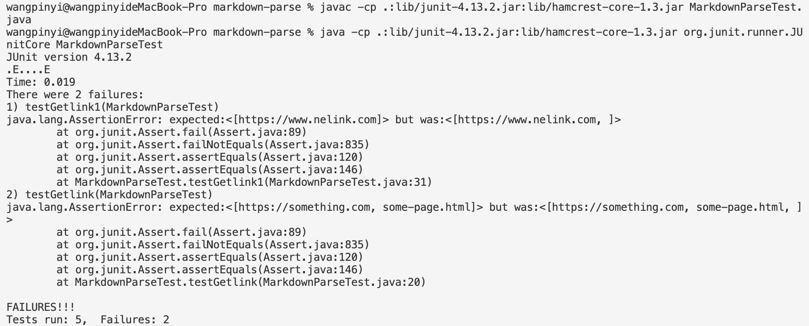

# Lab Report 2

## Code change 1
1a. Screenshot of the code change diff from Github

1b. Link to the test file for the failure-inducing input
[Link1](test-file.md)

1c. Symptom of this failure-inducing input
  
*Induce runtime error*

The bug of the original code is that the while loop would continuously run as current Index would be added without correctly indicating ending position. The failure-inducing input is the test-file.md that the code takes in and runs for, in this case due to the bug, generate the symptom of output being continously printed out and eventually stack overflow error. 

## Code change 2
2a. Screenshot of the code change diff from Github

2b. Link to the test file for the failure-inducing input
[Link2](test-file-4.md)

2c. Symptom of this failure-inducing input

*Induce logical error*

The bug of the original code is that it doesn't handle the situation when the input is a image instead of link. The failure-inducing input is the test-file-4.md that contain a link and an image test.png, and in this case becasue of the bug, the string of "test.png" is printed when it is not supposed to be printed out. 

## Code change 3
3a. Screenshot of the code change diff from Github

2b. Link to the test file for the failure-inducing input
[Link3](test-file.md)
[Link4](new-test-file.md)

3c. Symptom of this failure-inducing input

*Failure of the junit testers*

The bug in this case is at the MarkdownParseTest file. When writing the asswerEquals methods to check whether the expected and actual output are equal, I didn't take the empty close brackets and open brackets input  into consideration，and didn't include it as part of the expected output when writing the junit test. The failure-inducing inputs are the two test files that contain the empty brackets that the test file test for. When running the Getlink1 and Getlink2 methods that didn't construct correct assertEqual checks in the MarkdownParseTest file, this casue the junit test to fail. 