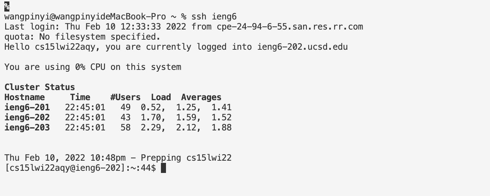

# Lab Report 3

## Streamlining ssh Configuration

> Section 1: config file and how to edit it
The config file can be opened when direct to the ~/.ssh directory. The .ssh/confi file should looks like this after setup. 

I use the vim config command to edit the file, and then enter i to go into the insert mode. After editing the file, press esc to exit the insert mode, and type :wq to exit the file and return back to the terminal. The file that is opened with vim in terminal for editing looks like this:

> Section 2: ssh command after setting up the config file
The alias I chose is just ieng6, and after setting up the config file, the ssh login command should generate this result: 

> Section 3: scp command
I created a file in my computer called WhereAmI2.java, and used the scp command to copy it into the ieng6 server. The command would not need any password and the alias would be simply ieng6.

