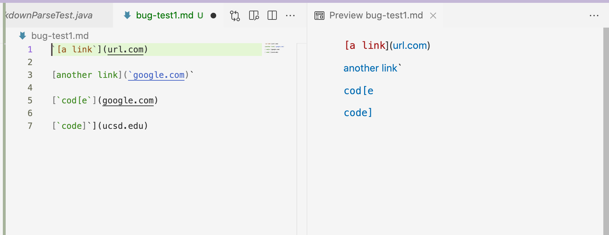
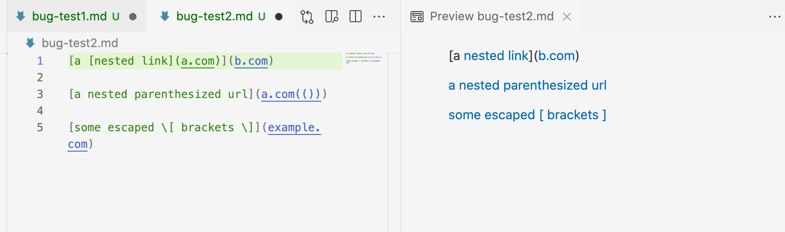
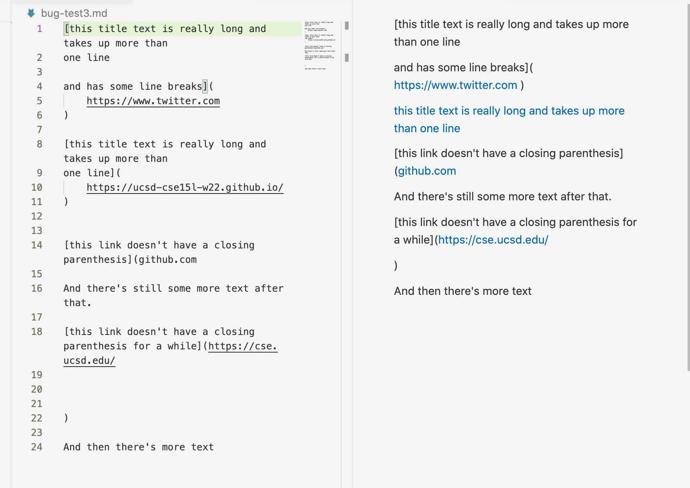
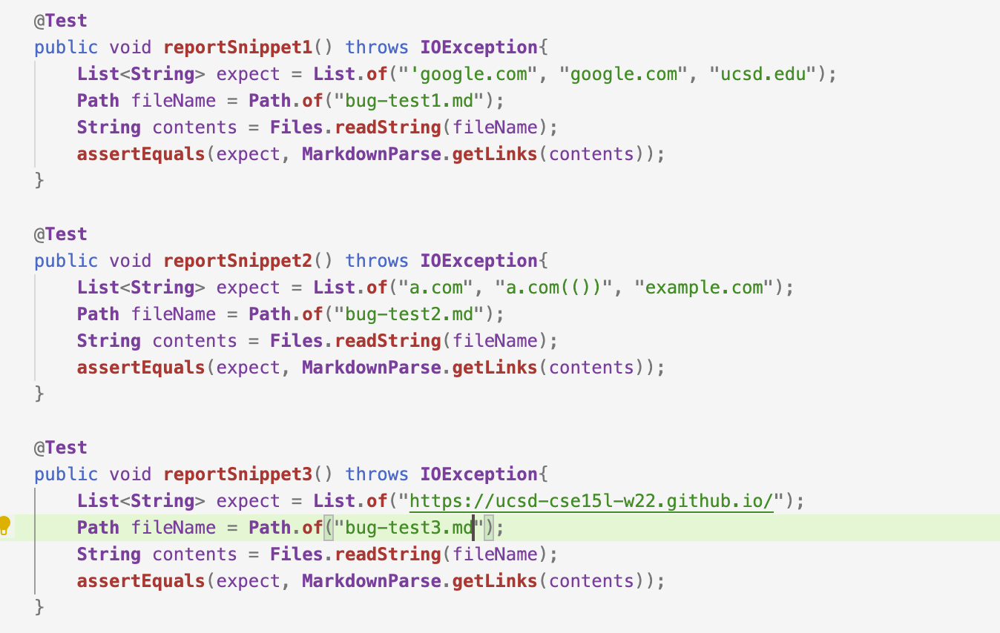
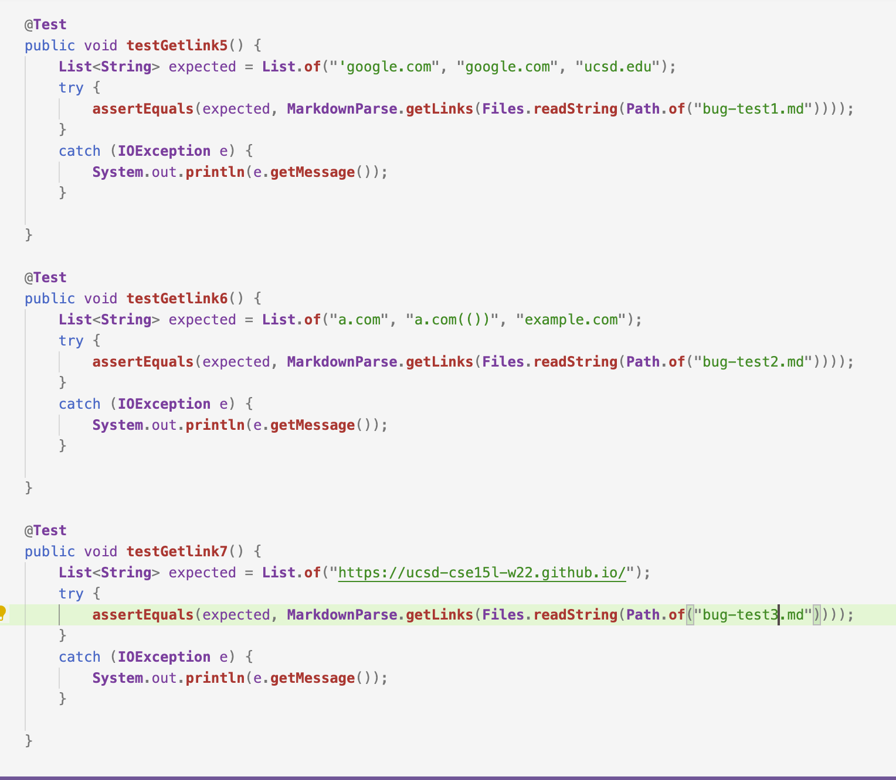
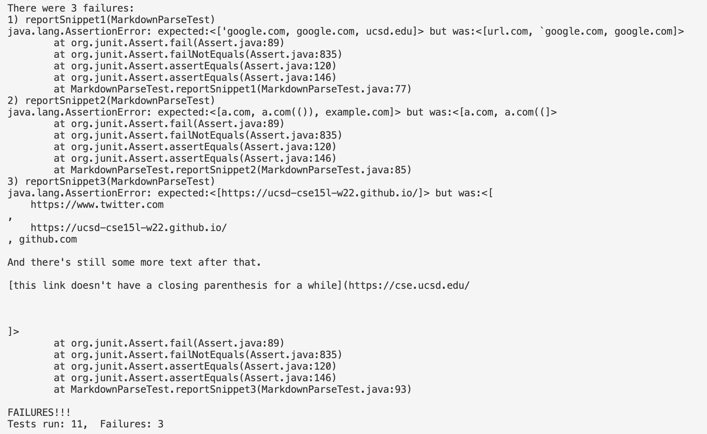
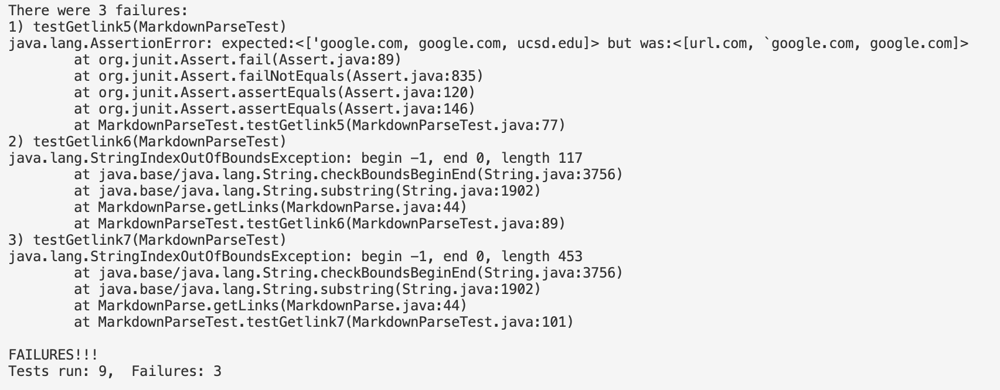

# Lab Report 4

## 1. Link to markdown-parse repository
[Link of my own one](https://github.com/mariawang2002826/markdown-parse.git)

[Link of reviewed](https://github.com/JaredJose/markdown-parse)

## 2. The preview of the expected links
Using the preview function in the VS Code can help determine what the snippets would produce, and can then be written as "expect" in the test.

## 3. Add tests to both markdown-parse implementations
Based on what show in preview, the tests can bewritten as below:

a) tests on implementation reviewed

b) tests on my implementation

## 4. Errors of both mark-down parse implementations
Both implementations have failures on the Junit tests for all three snippets, but the type of failures are different. 

a) Tests result of the implementation reviewed

b) Tests result of my implementation

## 5. Answer of questions

a) One possible solution is to create two variables to track the pair of backticks. If any open, close bracket and parenthesis is found inside the beginning of the backtick (index of the backets or parens greater than the index of open backtick in one while loop), the current loop should be skipped and the link should not be printed (use continue).

b) The trouble is that when I add if statement try to test for the "!" of the image and exclude the link, the method that takes the substring of nextOpenBracket-1 and nextOpenBracket would raise stringindexoutofbound in case of multiple open brackets present. A if condition before this to check whether nextOpenBracket is greater or equal to 0 and then put the image check into the if clause would solve the problem. There is also possible problem of printing the wrong link due to the multiple parenthesis and brackest (something happen in implementation reviewed bu can't be seen in my tests), and a helper method that try to make sure their are always a pair of [], ](, and (), and return the index of them to give idea of what inside them should be printed. 

c) The trouble is the same that -1 index raises in the "!" check, so it can also be fixed possibly with the adding of another if conditioin to make sure the nextOpenBracket-1 is always non-negative. Also, for the problem that the method doesn't print the expected output in the implementation reviewed, there can be a tracker added to find whether there is a line seperation character or argument in the files between any pairs of parentheses and brackets. 
