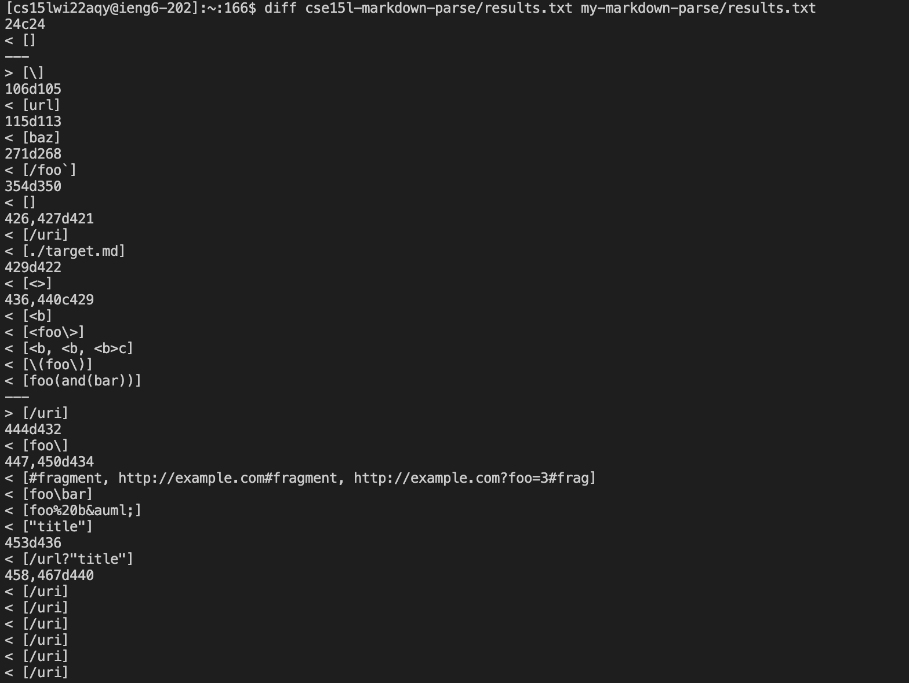
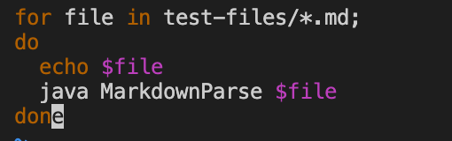
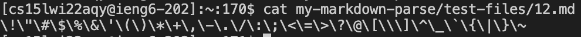
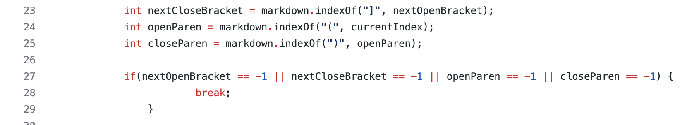
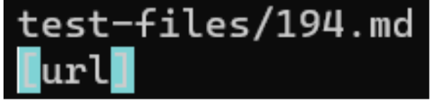
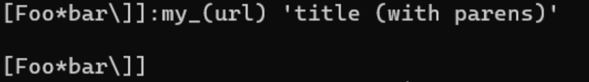
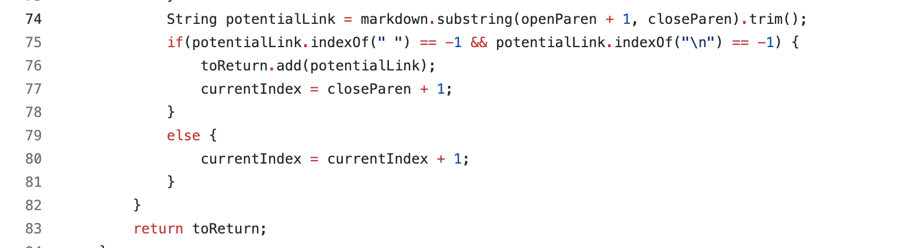

# Lab Report 5

In this lab, we run the professor's markdown-parse and our our markdown-parse implementation with the 652 commonmark-spec tests. Affter converting the bash script.sh into results.txt for the implementation of both the professor's and our markdown-parse with the tests, I run the `diff markdown-parse/results.txt my-markdown-parse/results.txt` command, and the differences between the results of testing are shown with the corresponding line number. 

 

In order to identify which tests the lines are pointing at, I edit the script.sh to add a line of code that makes all test-file names printed out.

When this is done, then I am able to vim the results.txt file and check for which test file the line with difference fall under (by using ":set number" to set the line number)

## Difference 1
The first difference happens in line 24, which is test-files 12. The professor's markdownparse printed out [\\] for this test while our implementation printed out [] for it.

In this case, the professor's implementation is correct since there are a lot of different things between the [] and the (\\), which should not be counted as a valid link and should not be printed out. The code that I think might have some problems in my implementation is 

The code block above just assing the next found "(" after `currentIndex` as `openParen`, which means it checks a set of parentheses instead of the combination of close and open parentheses in correct order. This is the problem for this case, as the code fails to check whether the `nextCloseBracket` and `openParen` are next to each other, and still recognize the () and [] not in correct order. Change the code to check after `nextCloseBracket` instead of `currentIndex` might help.

## Difference 2
The second difference happens in line 212 where the test file 194 locates. The test file is shown as below

In this case, I think my implementation is correct. The professor's implementation printed out [url], which should not supposed to be printed out as there is no valid ()[] link structure. My implementation in this case printed out [], which I think is correct cause the file doesn't contain any valid link.

I think the problem might appears in this code block above. The code only checks for the situation that there is a new line or space character after the `closeParen`, and if there is not, move current index to read the next link. However, it doesn't check for other case like the character after ")" could be a "`", which doesn't even make the link a valid link. More checks or another iteration method should be implemented to fix this bug.